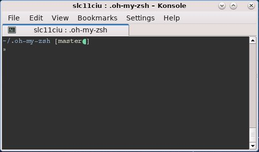
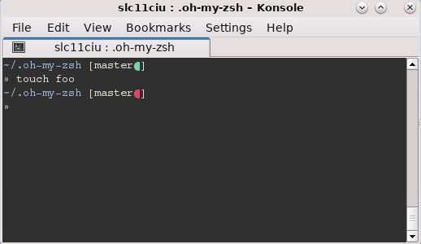

# oh-my-zsh-customizations

A repository for [oh-my-zsh](https://github.com/robbyrussell/oh-my-zsh/tree/master/themes) customizations.

## Themes

### minimal2

_minimal2_ is a tweak of the minimal theme. The tweaks include

1. The prompt uses two lines; the first line displays the current working directory and the VCS status and
   the second line is the cursor. Longer directory paths do not push the prompt too far to the right.

2. A clean VCS status includes a `green` dot. This improves the visual cue for a clean working directory.

3. The working directory uses a foreground color of `blue` instead of the original `white`.

